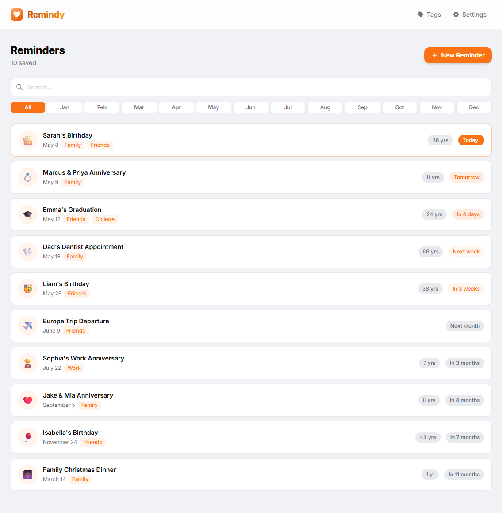

# Remindy



[](LICENSE)
[](https://hub.docker.com/r/larsmikki/remindy)
[](https://github.com/larsmikki/remindy/pkgs/container/remindy)
[](https://nodejs.org/)

**Remindy** is a self-hosted birthday reminder app. Keep track of birthdays, add tags and icons, and never forget an important date — no database, no cloud, no accounts required.

## Features

- Add birthdays with name, date, icon, and notes
- **Tags** — organize birthdays into custom categories
- Search and filter your list
- Countdown to the next birthday for each person
- Export and import backups as JSON
- 10+ built-in themes (light and dark)
- No database — all data stored in a single JSON file
- No tracking, no accounts, no cloud

## Requirements

- Docker and Docker Compose

## Docker setup

### Quick start

```bash
docker run -d \
  --name remindy \
  -p 3080:3080 \
  -v remindy-data:/app/data \
  --restart unless-stopped \
  larsmikki/remindy:latest
```

Then open [http://localhost:3080](http://localhost:3080).

### Docker Compose (recommended)

```yaml
services:
  remindy:
    image: larsmikki/remindy:latest
    container_name: remindy
    ports:
      - "3080:3080"
    volumes:
      - remindy-data:/app/data
    restart: unless-stopped

volumes:
  remindy-data:
```

## Configuration

| Variable | Default | Description |
|----------|---------|-------------|
| `PORT` | `3080` | Port the server listens on |
| `BIRTHDAYS_FILE` | `/app/data/birthdays.json` | Path to the data file |

## Usage

| Action | How |
|--------|-----|
| Add a birthday | Click **Add Reminder** |
| Edit | Click the pencil icon on any card |
| Add tags | **Settings → Tags** |
| Filter by tag | Click a tag badge on the main page |
| Export backup | **Settings → Export** |
| Import backup | **Settings → Import** |
| Change theme | **Settings → Themes** |

## Data

All data is stored in a single file in the Docker volume:

```
/app/data/
  birthdays.json    # all birthdays, tags, and settings
```

## License

[MIT](LICENSE)

## Support

If Remindy saves you time, consider [buying me a coffee](https://buymeacoffee.com/larsmikki) or [donating via PayPal](https://paypal.me/larsmikki). It helps keep the project free and maintained.
